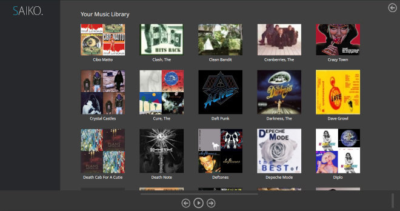
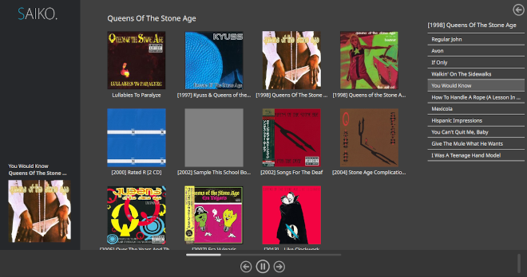

## Saiko ##

Saiko is an offline music player and and organisational tool for managing multiple libraries of music. Unlike traditional music players that index your library using the meta tags in your audio files (EG ID3v2), Saiko respects the existing directory structure of your music.

Furthermore, it does so while providing a pleasing interface with minimal effort from the user. Saiko will search for suitable album art and generate the best image to display.

Still in development but is fully functional.

### Requirements

Currently there is not a release build of Saiko, so the application has to be built from scratch. Therefore, the following are required to build the project.

* Linux (Windows support to come)
* C++17 compiler
* CMake, Make
* QtCreator, Qt

### How to build

1. Open QtCreator
2. Navigate to Saiko.pro and select to import project
3. Once the project has been configured for your system, simply use the run command in QtCreater
4. The application can also be found in the bin folder and run there

### Setup and using Saiko

To specify your music library path, modify configLib.txt.
If you wish to use another file, just run Saiko with -c and specify another file to parse music library paths from, like so 

```sh
    ./Saiko -c ../music_config.txt
```

### Gallery




